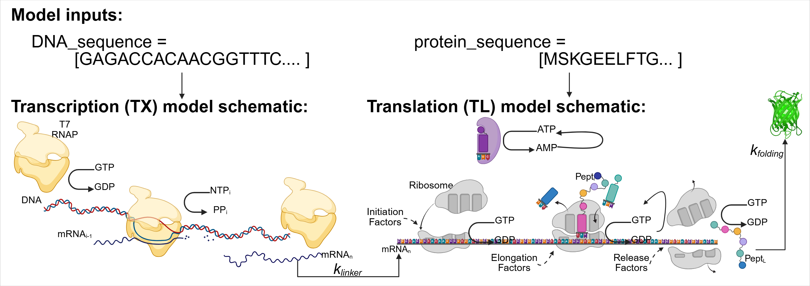

# A chemical reaction network model of PURE

Data and models repository for the paper "Nucleotide-level chemical reaction network modeling enables quantitative prediction of reconstituted cell-free expression system," along with additional simulations and validation experiments. The folder contains all Python scripts used to simulate protein expression and plot figures seen in the paper "Nucleotide-level chemical reaction network modeling enables quantitative prediction of reconstituted cell-free expression system" by Zoila Jurado, Ayush Pandey, and Richard M. Murray. Additionally, all simulation runs and experimental results are included.

# Table of contents
- [Setup](#Installation)
- [PURE Models](#PURE-CRN-models)
- [Running Inference on TX-only Model](#Inferencing-on-TX-only-data)
- [Experimental Data and Simulation Results](#Experimental-data-and-simulation-results)
- [Author Contributions](#Author-contributions)

## Installation

1. Run `pip install -r requirements.txt` from your terminal.

Or, if you prefer to install everything manually, you can:
1. Install biocrnpyler: `pip install biocrnpyler>=1.1.1`
2. Install bioscrape: `pip install bioscrape>=1.2.0`
3. If Step 2 fails, you can clone the [Bioscrape](https://github.com/biocircuits/bioscrape/) repository and manually install the package. Run `python setup.py install` to install bioscrape once you meet all the [installation requirements](https://github.com/biocircuits/bioscrape/wiki/Installation).
4. Install seaborn, holoviz, corner, svglib, scikit-learn, bokeh-catplot, openpyxl, bokeh, jupyter_bokeh ==2.0.0, and panel==0.13.1

## PURE CRN models
We use BioCRNpyler to generate chemical reaction network models to building a transcription (TX) and translation (TL) model for cell-free protein synthesis using PURE. The generation of all models are in the `modeling/` directory in this repository.

To run the models, follow these steps:

1. Edit the Input Sequence: Open the model generation script and input your specific DNA sequence—for example, the deGFP sequence—and the corresponding protein sequence to initialize the model.
2. Configure Parameters: Ensure the initial conditions for metabolites, such as ATP and GTP concentrations, are set according to your experimental PURE system setup.
3. Generate the Network: Execute the script to allow BioCRNpyler to compile the mechanistic mass-action reactions.
4. Run the Simulation: You may run all reactions sequentially to observe the time-course dynamics of all species.
5. Analyze Outputs: The model will provide data on protein yield.

## Inferencing on TX-only data 
Scripts and results for the parameter inferencing for the TX-only model on MGapt expression is under the `Inferencing_MGapt` directory. Parameter inference was performed iteratively, starting with an initial coarse fit. This was followed by fine-tuning the most sensitive parameters, as identified by sensitivity analysis, and finally incorporating auxiliary translation reactions that occur independently of protein production.

The following steps outline the inference pipeline used in the paper:

1. Experimental Data Pre-processing: Raw MGapt fluorescence time-courses are loaded and prepared as the target data for the Bayesian inference process.
2. Model Parameterization: The TX-only CRN is initialized with specific DNA inputs and the MGapt reporter sequence at the 5'-terminus.
3. Prior Distribution Definition: Prior distributions are established for unknown kinetic parameters, such as the T7 RNAP binding and elongation rates.
4. MCMC Sampling: Bayesian inferencing is performed using Markov Chain Monte Carlo (MCMC) sampling to estimate the posterior distribution of the transcription parameters.
5. Parameter Validation: The resulting inferred parameters are used to simulate the TX-only model to ensure the predicted fluorescence matches the experimental MGapt accumulation.
6. Model Integration: These validated transcription parameters are then carried forward as fixed values for the integrated TX-TL PURE model.

## Experimental data and simulation results
Experimental data:
- All calibration data used of this repository is available under the `Data_files` directory. Additional calibration data use can be found under the `Calibration_Curves/Calibration_MGapt' directory. The plasmids used in this paper are available from [myTXTL T7 Expression Kit](https://arborbiosci.com/products/cell-free-protein-synthesis/mytxtl-cell-free-expression-kits/mytxtl-t7-expression-kit/).

Simulation Results
- All simulations from the model are available under the `Simulation_results` directory in folders corresponding with model run. Subfolder `Nuclues_Simulations` contains, specific simulations around the separation of transcription and translation under different nucleus conditions.

SBML models:
- All generated SBML models are available in the `Models` directory.

Scripts:
-All scripts used to build model and plotting are located in the main folder. 

## Author contributions
* **Z. J.** - Project conceptualization, mathematical model development, experimental execution, data analysis, parameter fitting, and primary manuscript writing.
* **A. P.** - Model development (specifically the implementation of parameter-fitting algorithms) and manuscript revision.
* **R. M. M.** - Project supervision and manuscript editing.

## References
The PURE CRN model is based on [Matsuura 2017](https://www.pnas.org/doi/full/10.1073/pnas.1615351114). For more details, see [PURE simulatator](https://sites.google.com/view/puresimulator).

